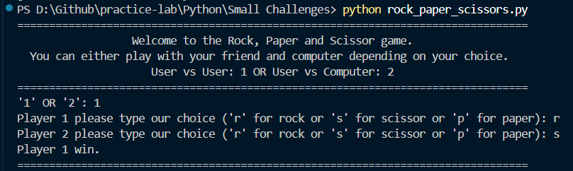
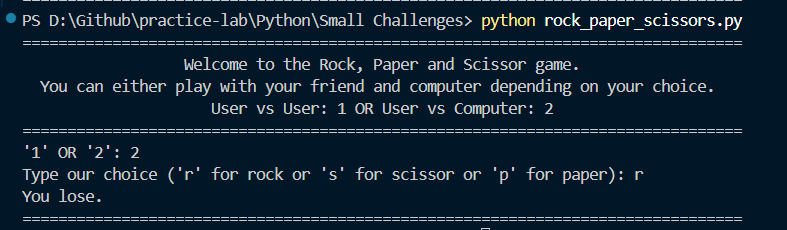
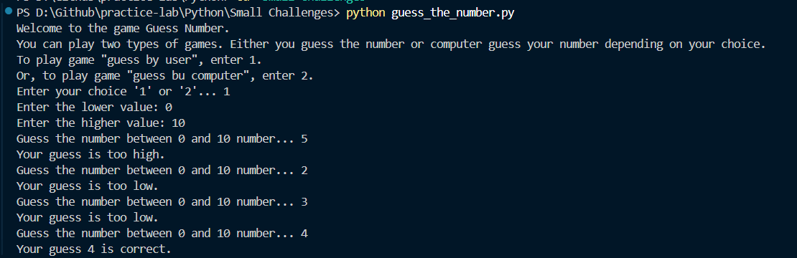
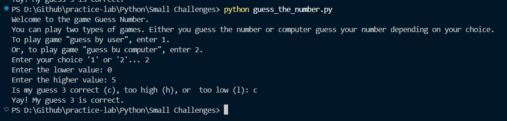

# Python Practice Lab

**Purpose:** A dedicated space to document and track small Python exercises, challenges, and logic puzzles.

## 📂 Project Structure

* [Small Challenges](./Small%20Challenges/) - A collection of standalone scripts and games.
  * [Rock Paper Scissors](#-rock-paper-scissors-game)
  * [Guess the Number](#guess-the-number)
* [Assets](/Assets/) - A collection of screenshots

---

## 🎮 Rock Paper Scissors Game

[View Code](./Small%20Challenges/rock_paper_scissors.py)

A classic CLI-based game where you can test your luck against the machine or a friend.

### Features

* **Two Game Modes:** User vs. User or User vs. Computer.
* **Randomized AI:** Uses the `random` module for computer logic.

#### Preview

**User vs. User**


**User vs. Computer**


---

## Guess the Number

[View code](./Small%20Challenges/guess_the_number.py)
A dual-mode guessing game where either the user or the computer attempts to identify a hidden number within a specified range.

### Features

* **User Mode:** The user attempts to guess a randomly generated number. The program provides "too high" or "too low" feedback.
* **Computer Mode:** The user thinks of a number, and the computer uses a narrowing range logic to guess it based on user feedback (h, l, or c).
* **Custom Range:** Supports dynamic low and high boundaries defined by the user at runtime.
* **Error Handling:** Includes try-except blocks for non-integer inputs and logic checks for contradictory range boundaries.

#### Preview

**User Guessing**


**Computer Guessing**


---

## 🚀 How to Run

1. Clone the repository.
2. Navigate to the `Small Challenges` folder.
3. Run the following command:

`name_of_the_script` is a placeholder.

```sh:
python name_of_the_script.py
```
